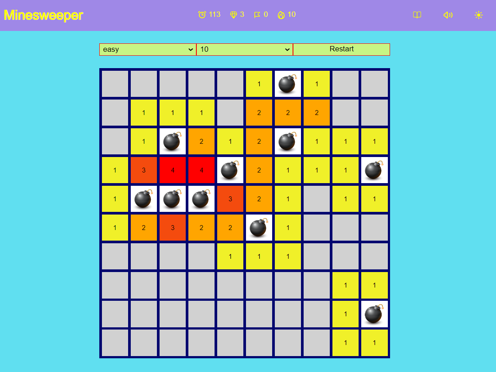

# Minesweeper

### My realization of the world-wide popular [game](https://en.wikipedia.org/wiki/Minesweeper_(video_game)).

Developed as a training of native JS (OOP) and alghorytms.

## The tech stach are:
- Native JS (OOP)
- SASS(SCSS) with the BEM methodology
- Webpack for dev server and the project build

## In order to launch this project locally you will need to:
- clone the project repo
- npm i to install all the required dependencies
- npm run dev to start your local dev server.

[Link to the page deploy](https://nikolaykrishtopa.github.io/minesweeper/)

Note: to mark the cells suspended to be armed with a flag you need to use right buton click for desktop of long-press-tap for mobile.

Enjoy!
 